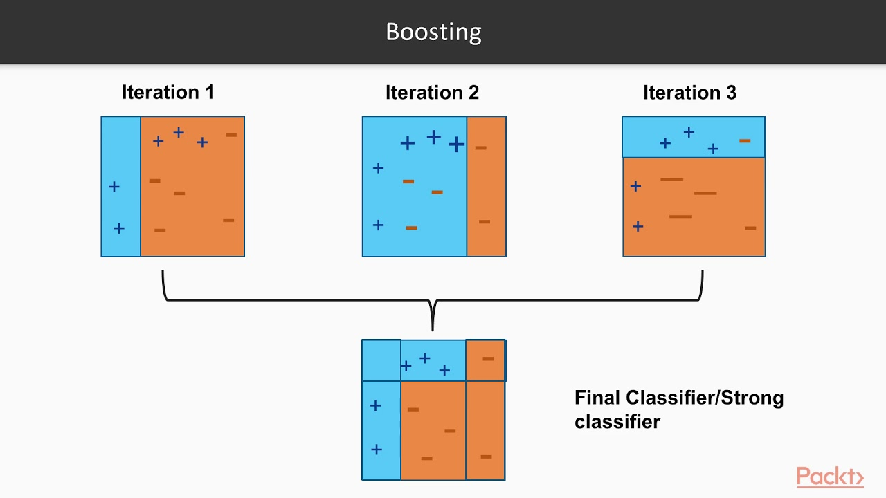
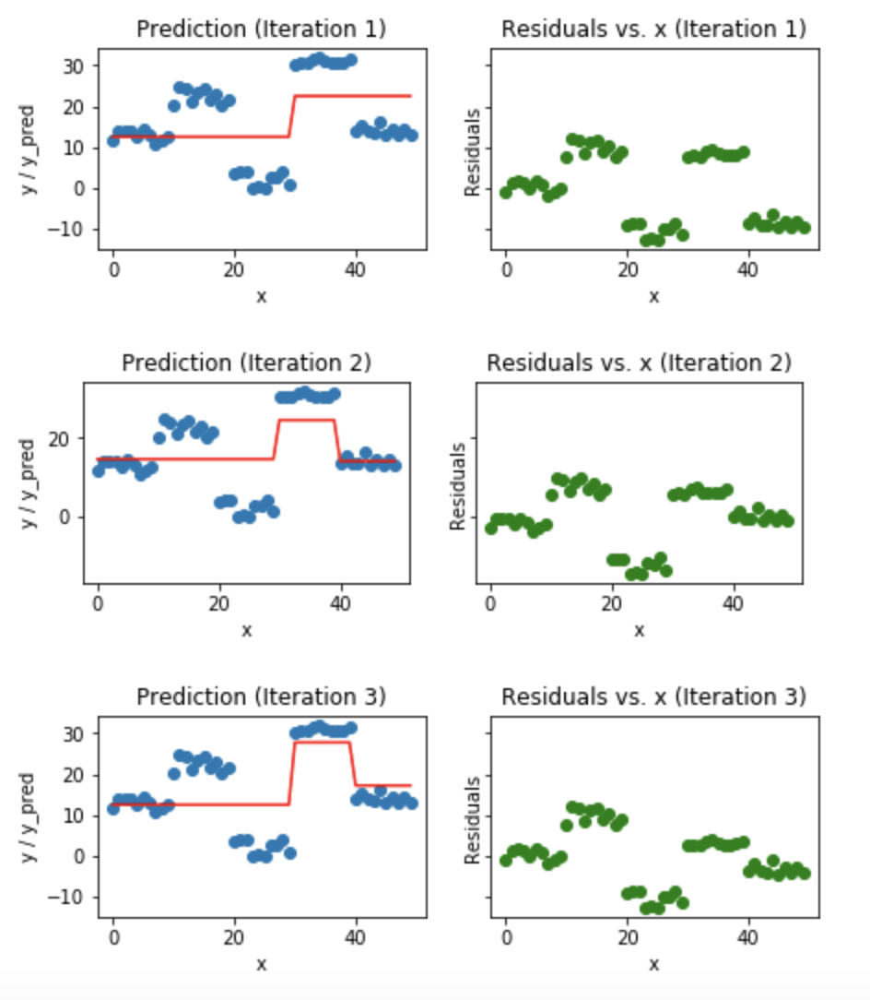
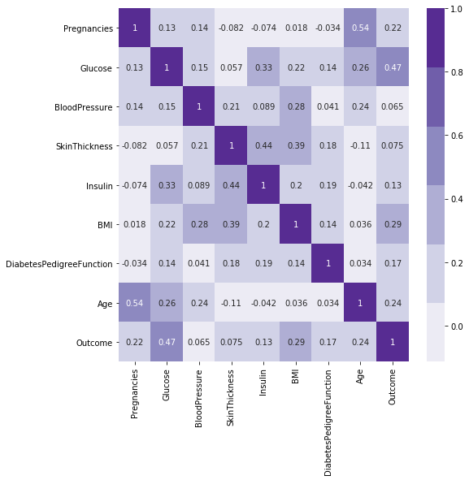
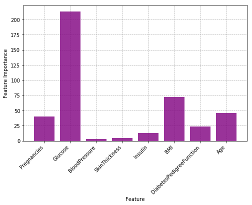

### Questions

### Objectives
YWBAT
- Compare and contrast decision trees with Random Forest Models
- Compare and contrast ADABoost with Gradient Boosting
- Tune hyperparameters to increase desired metric
- Analyze model for use case
- Build a pipeline that will analyze an individual patient

### What is a random forest

Where does the 'forest' part of the name come from?
- It's a collection of decision trees


Where does the 'random' part of the name come from?
- Each tree has a random sample of features from the dataset

How does it classify?
- Passes a data point through each tree
- Picks the label with the most 'votes'


### Real Life Structures
- Forests with 20, 100, 1000 trees
- Tree Depth - 5 layers, 10 layers, 20 layers, etc


### Analyze 
- Feature Importance
- The variance of 'accuracy' with regards to pruning of hyperparameters

### Adaboosting - sampling
- Steps to perform Adaptive Boosting
    - 1: Split Train Data in/out 70/30
    - 2: Build stump on in sample (70%)
    - 3: calculate error on out of bag of sample
    - 4a: Increase weights of out of bag samples that are incorrect
    - 4b: Decrease weights of out of bag samples that are correct
    - 5: Build next stump
    - Repeat 1 - 5
    - Aggregate voting 
    
    



### Gradient boosting - residuals
- How does this work for linreg/logistic? 
    - Minimizing Error (residuals, rmse, r_squared)
    - Adjusting $\beta_i$s based on the steps using the derivative of the error function w/ respect to $\beta_i$s

- What makes it so different for Random Forest? 
    - There is no parametric equation for a random forest...
    - Let's look at an image
    
    
    
- Pros
    - More Awesome - More Robust 
    - Minimizes error 
- Con
    - Overfitting 
    - Computationally Expensive 

### Outline


```python
import pandas as pd
import numpy as np

from sklearn.ensemble import RandomForestClassifier, AdaBoostClassifier, GradientBoostingClassifier
from sklearn.model_selection import train_test_split
from sklearn.feature_selection import SelectKBest
from sklearn.metrics import confusion_matrix, classification_report

import matplotlib.pyplot as plt
import seaborn as sns
```

### Let's build a kick a** model


```python
df = pd.read_csv("./pima-indians-diabetes.csv")
df.head()
```


<div>
<style scoped>
    .dataframe tbody tr th:only-of-type {
        vertical-align: middle;
    }

    .dataframe tbody tr th {
        vertical-align: top;
    }

    .dataframe thead th {
        text-align: right;
    }
</style>
<table border="1" class="dataframe">
  <thead>
    <tr style="text-align: right;">
      <th></th>
      <th>Pregnancies</th>
      <th>Glucose</th>
      <th>BloodPressure</th>
      <th>SkinThickness</th>
      <th>Insulin</th>
      <th>BMI</th>
      <th>DiabetesPedigreeFunction</th>
      <th>Age</th>
      <th>Outcome</th>
    </tr>
  </thead>
  <tbody>
    <tr>
      <th>0</th>
      <td>6</td>
      <td>148</td>
      <td>72</td>
      <td>35</td>
      <td>0</td>
      <td>33.6</td>
      <td>0.627</td>
      <td>50</td>
      <td>1</td>
    </tr>
    <tr>
      <th>1</th>
      <td>1</td>
      <td>85</td>
      <td>66</td>
      <td>29</td>
      <td>0</td>
      <td>26.6</td>
      <td>0.351</td>
      <td>31</td>
      <td>0</td>
    </tr>
    <tr>
      <th>2</th>
      <td>8</td>
      <td>183</td>
      <td>64</td>
      <td>0</td>
      <td>0</td>
      <td>23.3</td>
      <td>0.672</td>
      <td>32</td>
      <td>1</td>
    </tr>
    <tr>
      <th>3</th>
      <td>1</td>
      <td>89</td>
      <td>66</td>
      <td>23</td>
      <td>94</td>
      <td>28.1</td>
      <td>0.167</td>
      <td>21</td>
      <td>0</td>
    </tr>
    <tr>
      <th>4</th>
      <td>0</td>
      <td>137</td>
      <td>40</td>
      <td>35</td>
      <td>168</td>
      <td>43.1</td>
      <td>2.288</td>
      <td>33</td>
      <td>1</td>
    </tr>
  </tbody>
</table>
</div>


```python
df.info()
```

    <class 'pandas.core.frame.DataFrame'>
    RangeIndex: 768 entries, 0 to 767
    Data columns (total 9 columns):
    Pregnancies                 768 non-null int64
    Glucose                     768 non-null int64
    BloodPressure               768 non-null int64
    SkinThickness               768 non-null int64
    Insulin                     768 non-null int64
    BMI                         768 non-null float64
    DiabetesPedigreeFunction    768 non-null float64
    Age                         768 non-null int64
    Outcome                     768 non-null int64
    dtypes: float64(2), int64(7)
    memory usage: 54.1 KB


```python
df.isna().sum()
```


    Pregnancies                 0
    Glucose                     0
    BloodPressure               0
    SkinThickness               0
    Insulin                     0
    BMI                         0
    DiabetesPedigreeFunction    0
    Age                         0
    Outcome                     0
    dtype: int64


### No data cleaning needed

### Look at class counts


```python
df.Outcome.value_counts()
```


    0    500
    1    268
    Name: Outcome, dtype: int64


```python
corr = df.corr()
plt.figure(figsize=(8, 8))
sns.heatmap(corr, cmap=sns.color_palette('Purples'), annot=True)
plt.show()
```





### Using SelectKBest to find Feature Importance


```python
x, y = df.drop('Outcome', axis=1), df["Outcome"]
```


```python
kbest = SelectKBest(k=5)
```


```python
x_new = kbest.fit_transform(x, y)
x_new
```


    array([[  6.   , 148.   ,  33.6  ,   0.627,  50.   ],
           [  1.   ,  85.   ,  26.6  ,   0.351,  31.   ],
           [  8.   , 183.   ,  23.3  ,   0.672,  32.   ],
           ...,
           [  5.   , 121.   ,  26.2  ,   0.245,  30.   ],
           [  1.   , 126.   ,  30.1  ,   0.349,  47.   ],
           [  1.   ,  93.   ,  30.4  ,   0.315,  23.   ]])


```python
kbest.scores_ # these are the feature important scores for all the columns
plt.figure(figsize=(8, 5))
plt.grid(linestyle='dashed', zorder=1)
plt.bar(x.columns, kbest.scores_, zorder=2, color='purple', alpha=0.8)
plt.xticks(x.columns, x.columns, rotation=45, ha='right')
plt.ylabel("Feature Importance")
plt.xlabel("Feature")
plt.show()
```





```python
cols = [x.columns[i] for i, b in enumerate(kbest.get_support()) if b == True]
cols # getting column names of best columns
```


    ['Pregnancies', 'Glucose', 'BMI', 'DiabetesPedigreeFunction', 'Age']


```python
x = df[cols]
y = df['Outcome']
```


```python
xtrain, xtest, ytrain, ytest = train_test_split(x, y, train_size=0.80)
```


```python
xtrain.shape
```


    (614, 5)


```python
def make_model(xtrain, ytrain, weights=None):
    clf = RandomForestClassifier(n_estimators=5, min_samples_leaf=15, class_weight=weights)
    clf.fit(xtrain, ytrain)
    print(clf.score(xtrain, ytrain), clf.score(xtest, ytest))
    return clf
```

### Now what do I do? 


```python
def make_weights(ytrain):
    """
    distance from the total
    """
    w0 = ytrain.value_counts()[1]/ytrain.value_counts().max()
    w1 = ytrain.value_counts()[0]/ytrain.value_counts().max()
    d = {0: w0, 1: w1}
    return d


def make_weights2(ytrain):
    # inverse proportion 0s = 66% -> w0 = 33%
    total_0s = ytrain.value_counts()[0]
    total_1s = ytrain.value_counts()[1]
    total_labels = total_0s + total_1s
    
    w0 = 1 - total_0s / total_labels
    w1 = 1 - total_1s / total_labels
    d = {0: w0, 1: w1}
    return d
```


```python
# Let's handle class imbalance
# increase weights for train/test split
weights = make_weights(ytrain)
clf = make_model(xtrain, ytrain)
clf = make_model(xtrain, ytrain, weights=weights)
```

    0.8045602605863192 0.7467532467532467
    0.7915309446254072 0.7727272727272727


### Assessment


```python

```


```python

```
